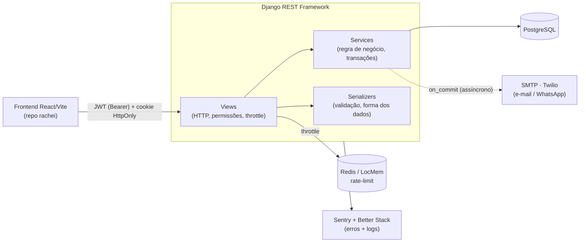

<div align="center">

# 🧡 Rachei — Backend (API)

**App de divisão de contas entre amigos** (estilo Splitwise): grupos, dívidas com divisão justa em centavos, **confirmação dupla** de pagamento, **compensação de saldos (netting)**, **2FA/TOTP** e notificações por e-mail/WhatsApp.


</div>

> Frontend (React + Vite + TypeScript) no repositório [`rachei`](https://github.com/yVilaca/rachei).

---

## 🎯 Por que este projeto é interessante

Não é um CRUD. Os pontos que valem o olhar:

- **🔐 Segurança levada a sério** — JWT com refresh em cookie `HttpOnly` (rotação + blacklist), 2FA/TOTP com segredo **criptografado em repouso** (Fernet), backup codes, dispositivos confiáveis, rate-limiting por rota, e uma **suíte de testes de IDOR** que tenta acessar recursos de outros usuários e prova que falha.
- **🔁 Regra de negócio real** — compensação de dívidas mútuas (netting) com `select_for_update` para serializar confirmações concorrentes, divisão de parcela de fronteira e trilha de auditoria.
- **💰 Matemática de dinheiro correta** — tudo em centavos (inteiro), com testes que garantem **soma das parcelas == total**.
- **🚀 Pronto para produção** — hardening com *fail-fast* (recusa subir com config insegura), cache compartilhado para throttle, observabilidade (Sentry + logs JSON + `/health`) e runbook de deploy.
- **✅ 199 testes** de negócio, segurança e autorização — todos verdes.

<div align="center">
<br>
<sub>A interface que consome esta API (repo <code>rachei</code>):</sub>
<br><br>
 &nbsp; 
</div>

---

## 🏗️ Arquitetura



O código segue **camadas explícitas**: a *view* cuida de HTTP/permissão, o *service* concentra a regra de negócio e as transações, o *serializer* valida e molda os dados.

---

## 📁 Estrutura

```
apps/
  users/          contas, login, 2FA/TOTP, backup codes, dispositivos confiáveis,
                  reset de senha, verificação de telefone, auditoria
  groups/         grupos, membros (papéis, convite por telefone, contatos pendentes)
  debts/          despesas e parcelas (divisão igual/personalizada em centavos)
  payments/       confirmação dupla, comprovante, link de cobrança público,
                  acerto (compensação/netting), dashboard, feed de atividade
  notifications/  e-mail + WhatsApp por evento (respeita preferências do perfil)
  e2e/            seed/reset — só sob settings_e2e (testes full-stack do frontend)
config/           settings (+ _test / _e2e), urls, observability
tests/            segurança, autorização (IDOR), JWT, throttles, regressão
```

---

<details>
<summary><b>▶️ Como rodar</b></summary>

<br>

Pré-requisitos: **Python 3.12+** e **PostgreSQL** local.

```bash
pip install -r requirements.txt
cp .env.example .env          # preencha (nunca commite o .env)
createdb rachei
python manage.py migrate
python manage.py runserver    # http://localhost:8000
```

Variáveis principais: `SECRET_KEY`, `DEBUG`, `ALLOWED_HOSTS`, `CORS_ALLOWED_ORIGINS`,
`DB_*`, `REDIS_URL` (prod), `TOTP_ENCRYPTION_KEY`, `EMAIL_*`, `TWILIO_*`, `SENTRY_DSN`.

</details>

<details>
<summary><b>🧪 Testes</b></summary>

<br>

```bash
python manage.py test --settings=config.settings_test
```

- **199 testes** de negócio, segurança e autorização; cobertura com gate no CI.
- Destaques: forja de JWT (`alg=none`, chave errada, expiração), replay de TOTP **sob concorrência real** (threads), IDOR entre grupos, throttle com spoof de `X-Forwarded-For`, matemática de centavos e transições de estado de pagamento.

</details>

---

## 🧰 Stack

| Camada | Tecnologia |
|---|---|
| Framework | Django 6.0 + Django REST Framework 3.17 |
| Auth | SimpleJWT (refresh em cookie HttpOnly, rotação + blacklist) |
| 2FA | `pyotp` (TOTP) + `cryptography` (Fernet, segredo criptografado) |
| Banco | PostgreSQL (dev, CI e produção) |
| Cache/throttle | Redis (prod) · LocMem (dev) |
| Observabilidade | Sentry + Better Stack (logs JSON) + `/health` + request-id |
| Notificações | SMTP (e-mail) + Twilio (WhatsApp/SMS) |

---

## 📚 Documentos

- [`CLAUDE.md`](CLAUDE.md) — convenções e padrões do código
- [`docs/DEPLOY.md`](docs/DEPLOY.md) — roteiro de produção (checklist de env, HTTPS, collectstatic)
- [`docs/NOTIFICACOES.md`](docs/NOTIFICACOES.md) — matriz e infra de notificações
