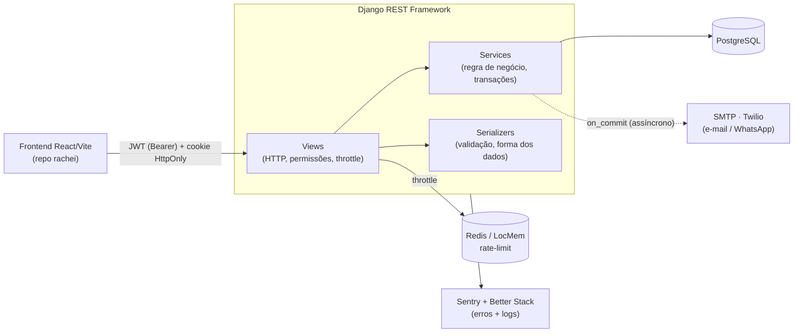

# Rachei — Backend (API)

API do **Rachei**, um app de divisão de contas entre amigos (estilo Splitwise): grupos, dívidas com divisão justa em centavos, **confirmação dupla** de pagamento, **compensação de saldos (netting)**, **2FA/TOTP** e notificações por e-mail/WhatsApp.

**Django 6 · Django REST Framework · PostgreSQL · JWT · 2FA · Sentry**

> Frontend (React + Vite + TypeScript) no repositório [`rachei`](https://github.com/yVilaca/rachei).

<!-- Dica: cole aqui um GIF do fluxo principal (criar dívida → pagar → confirmar → acertar). -->
<!--  -->

---

## Por que este projeto é interessante

Não é um CRUD. Os pontos que valem o olhar:

- **Segurança levada a sério**: JWT com refresh em cookie `HttpOnly` (rotação + blacklist), 2FA/TOTP com segredo **criptografado em repouso** (Fernet), backup codes, dispositivos confiáveis, rate-limiting por rota, e uma **suíte de testes de IDOR/autorização** que tenta acessar recursos de outros usuários e prova que falha.
- **Regra de negócio real**: compensação de dívidas mútuas (netting) com `select_for_update` para serializar confirmações concorrentes, divisão de parcela de fronteira e trilha de auditoria de "quitado por compensação".
- **Matemática de dinheiro correta**: tudo em centavos (inteiro), distribuição justa do resto, com testes que garantem a invariante **soma das parcelas == total**.
- **Pronto para produção**: hardening com _fail-fast_ (recusa subir com config insegura), cache compartilhado para throttle, observabilidade (Sentry + logs JSON estruturados + `/health`), e runbook de deploy.
- **199 testes** de negócio, segurança e autorização — todos verdes.

---

## Arquitetura



O código segue **camadas explícitas**: a _view_ cuida de HTTP/permissão, o _service_ concentra a regra de negócio e as transações, o _serializer_ valida e molda os dados. Isso mantém a lógica testável e fora das views.

---

## Estrutura

```
apps/
  users/          contas, login, 2FA/TOTP, backup codes, dispositivos confiáveis,
                  reset de senha, verificação de telefone, auditoria
  groups/         grupos, membros (papéis, convite por telefone, contatos pendentes)
  debts/          despesas e parcelas (divisão igual/personalizada em centavos)
  payments/       confirmação dupla, comprovante, link de cobrança público,
                  acerto (compensação/netting), dashboard, feed de atividade
  notifications/  e-mail + WhatsApp por evento (respeita preferências do perfil)
  e2e/            seed/reset — só sob settings_e2e (testes full-stack do frontend)
config/           settings (+ _test / _e2e), urls, observability (Sentry/logs/health)
tests/            suíte de segurança, autorização (IDOR), JWT, throttles, regressão
```

Convenções detalhadas em [`CLAUDE.md`](CLAUDE.md).

---

## Stack

| Camada | Tecnologia |
|---|---|
| Framework | Django 6.0 + Django REST Framework 3.17 |
| Auth | SimpleJWT (refresh em cookie HttpOnly, rotação + blacklist) |
| 2FA | `pyotp` (TOTP) + `cryptography` (Fernet, segredo criptografado) |
| Banco | PostgreSQL (dev, CI e produção — sem SQLite) |
| Cache/throttle | Redis (prod) · LocMem (dev) |
| Observabilidade | Sentry + Better Stack (logs JSON) + `/health` + request-id |
| Notificações | SMTP (e-mail) + Twilio (WhatsApp/SMS) |
| Servidor | gunicorn |

---

## Como rodar

Pré-requisitos: **Python 3.12+** e um **PostgreSQL** local.

```bash
pip install -r requirements.txt

cp .env.example .env          # preencha as variáveis (nunca commite o .env)
createdb rachei
python manage.py migrate
python manage.py runserver    # http://localhost:8000
```

### Variáveis de ambiente principais

| Variável | Para quê |
|---|---|
| `SECRET_KEY`, `DEBUG`, `ALLOWED_HOSTS` | básico do Django (em prod recusa subir sem `SECRET_KEY`) |
| `CORS_ALLOWED_ORIGINS` | origem do frontend (ex.: `http://localhost:5173`) |
| `DB_*` | conexão Postgres |
| `REDIS_URL` | cache/throttle compartilhado (obrigatório em produção) |
| `TOTP_ENCRYPTION_KEY` | chave Fernet do 2FA (obrigatória, sem fallback) |
| `EMAIL_*`, `SMS_BACKEND`, `WHATSAPP_BACKEND`, `TWILIO_*` | notificações (Console em dev) |
| `SENTRY_DSN`, `BETTERSTACK_*` | observabilidade (opcional em dev) |

---

## Testes

```bash
# suíte completa (Postgres, hasher rápido)
python manage.py test --settings=config.settings_test

# um arquivo específico
python manage.py test tests.test_settle_up --settings=config.settings_test
```

- **199 testes** de negócio, segurança e autorização; cobertura com gate no CI.
- Destaques: forja de JWT (`alg=none`, chave errada, expiração), replay de TOTP **sob concorrência real** (threads), IDOR entre grupos, throttle com spoof de `X-Forwarded-For`, matemática de centavos e transições de estado de pagamento.
- CI: GitHub Actions roda a suíte contra Postgres.
- E2E full-stack (no repo `rachei`, com `settings_e2e`): sobe o Django real contra um banco descartável.

---

## Documentos

- [`CLAUDE.md`](CLAUDE.md) — convenções e padrões do código
- [`docs/DEPLOY.md`](docs/DEPLOY.md) — roteiro de produção (checklist de env, HTTPS, collectstatic)
- [`docs/NOTIFICACOES.md`](docs/NOTIFICACOES.md) — matriz e infra de notificações
